<h1 align="center">Laptop Exchange · Laptop-Austausch</h1>

<p align="center">
  
</p>

<p align="center">
  <strong>A self-service booking system that let ~150 public-sector employees schedule their own laptop replacement.</strong><br>
  Built with Laravel 13 and Filament 4. The project is <strong>finished</strong> and <strong>runs in daily production use</strong> at the IT department of Kreis Groß-Gerau, Germany.
</p>

<p align="center">
  
  
  
  
  
  
  
  
</p>

---

> **EN** — Kreis Groß-Gerau had to swap out roughly 150 leased laptops. Coordinating that by phone and email would have meant hundreds of manual appointments. This application lets employees log in with the numbers already printed on their device, pick a free timeslot themselves, and tell IT which software they need on the new machine. The IT department runs the whole process from an admin panel: calendar, review queue, reminders, imports, exports and backups.
>
> **DE** — Der Kreis Groß-Gerau musste rund 150 Leasing-Laptops austauschen. Die Terminabstimmung per Telefon und E-Mail hätte hunderte manuelle Absprachen bedeutet. Diese Anwendung lässt Mitarbeitende sich mit den Nummern anmelden, die ohnehin auf ihrem Gerät stehen, selbst ein freies Zeitfenster buchen und angeben, welche Software sie auf dem neuen Gerät benötigen. Das IT-Center steuert den gesamten Prozess über ein Admin-Panel: Kalender, Warteschlange, Erinnerungen, Import, Export und Datensicherung.

---

## My role · Meine Rolle

**Sole developer — from requirements to the server that runs it today.** 76 commits between June and September 2026, no other contributors.

| | |
|---|---|
| **Requirements** | Turned the department's needs into a workable scope — including pushing back where the original specification did not survive contact with reality: it asked for hardware details employees cannot possibly know, and for a framework combination that cannot run together. |
| **Architecture** | Stack selection, data model, the service layer, the two-guard authentication split, and the decision to keep exports outside Filament's routing. |
| **Implementation** | The complete employee-facing application and the full Filament admin panel. |
| **Quality** | 188 feature tests covering the double-booking guards, the CSV importer, PDF and Excel exports, backup and restore, and role-based access for both roles. |
| **Deployment** | Wrote the bundle, install and update scripts, and carried out the first installation on the district's Debian server. |
| **Handover** | German user guides for employees and for administrators, plus a developer handbook for whoever maintains the code next. |

Built **AI-assisted** (Claude Code). The architecture, the design decisions documented below, the code review and the production deployment are my own.

> **DE** — Alleinentwickler: Anforderungsklärung, Architektur, Umsetzung, Tests, Deployment und Dokumentation, Juni bis September 2026. Die Umsetzung erfolgte KI-gestützt; Architektur- und Review-Entscheidungen liegen bei mir.

---

## Screenshots

<table>
  <tr>
    <td width="50%">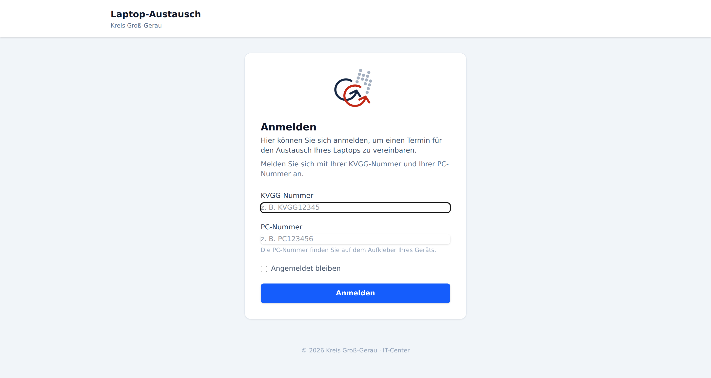<br><sub><b>Login</b> — employees sign in with their KVGG number and the PC number printed on their device sticker.</sub></td>
    <td width="50%">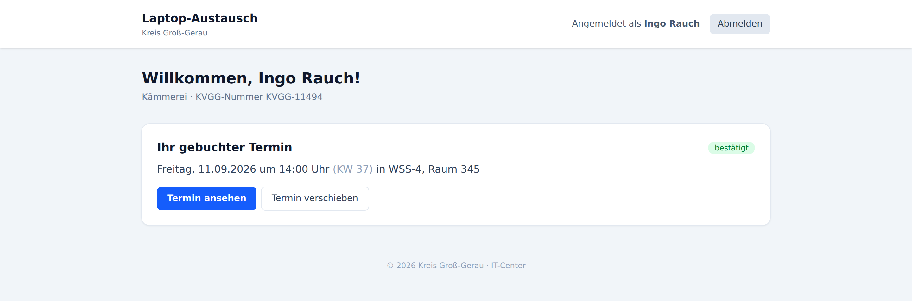<br><sub><b>Dashboard</b> — appointment at a glance, with location, calendar download and next steps.</sub></td>
  </tr>
  <tr>
    <td width="50%">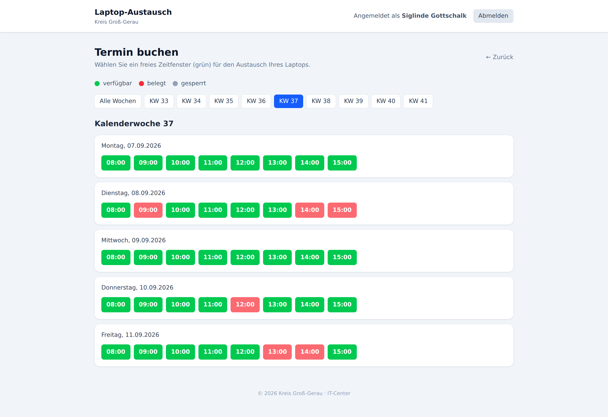<br><sub><b>Booking calendar</b> — timeslots grouped by calendar week, availability updates live.</sub></td>
    <td width="50%">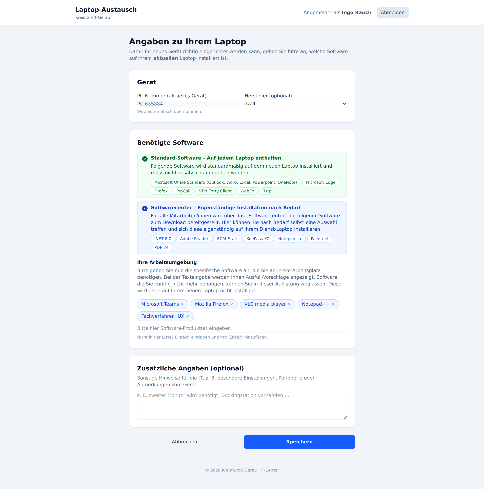<br><sub><b>Software form</b> — autocomplete-backed capture of the software IT has to reinstall.</sub></td>
  </tr>
  <tr>
    <td width="50%">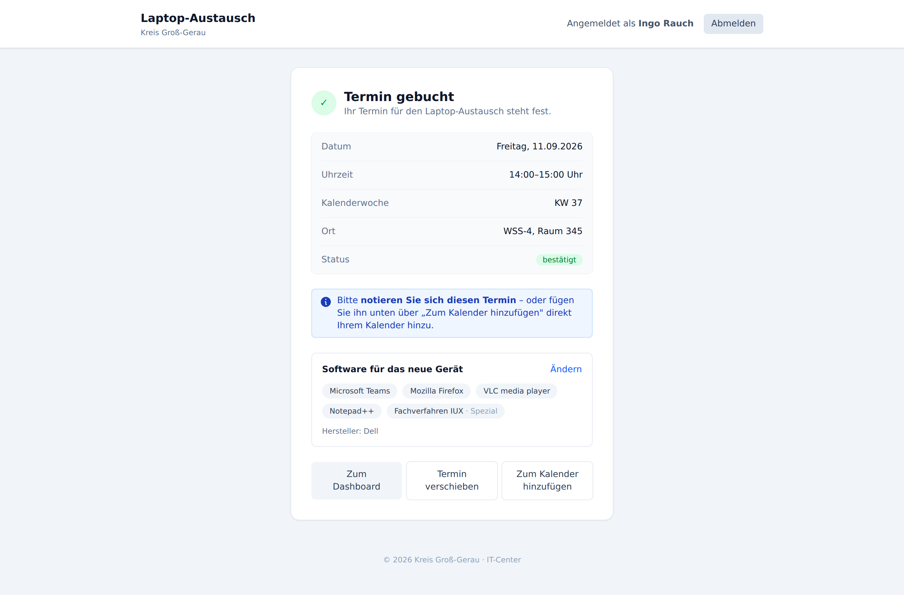<br><sub><b>Confirmation</b> — on-page summary plus an <code>.ics</code> download (the server has no mail access).</sub></td>
    <td width="50%">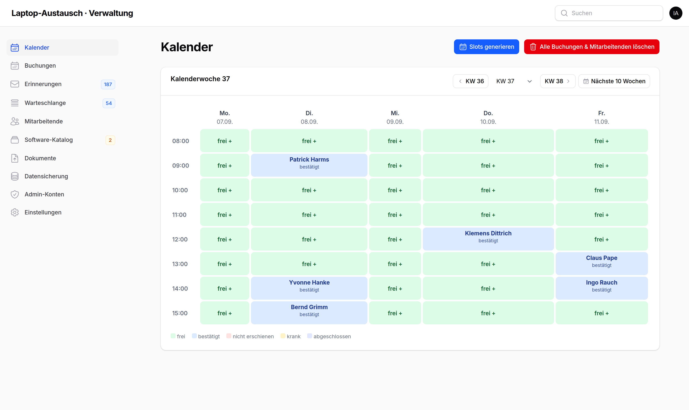<br><sub><b>Admin calendar</b> — the panel home. Click a free slot to book, a taken slot to open it.</sub></td>
  </tr>
  <tr>
    <td width="50%">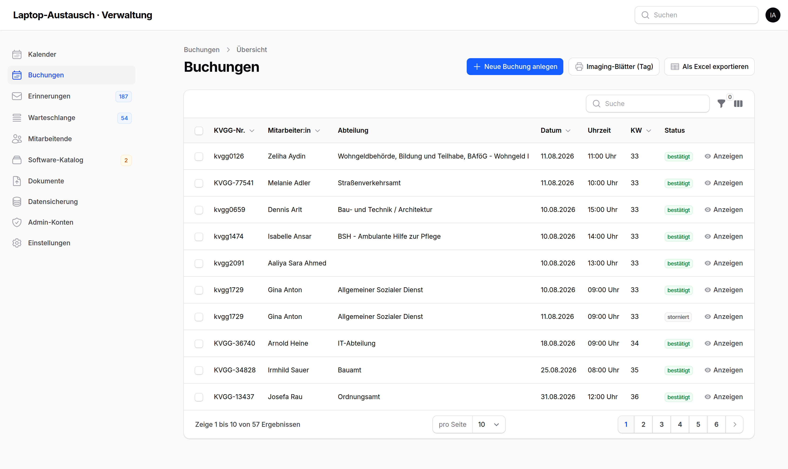<br><sub><b>Bookings</b> — filterable list; the Excel export mirrors exactly what is on screen.</sub></td>
    <td width="50%">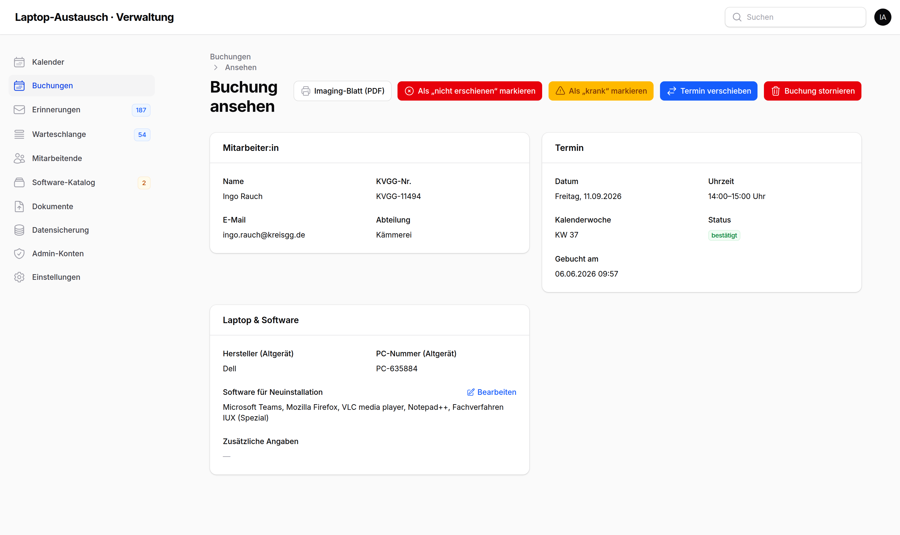<br><sub><b>Booking detail</b> — mark no-show or sick, move, cancel, or print the imaging sheet.</sub></td>
  </tr>
  <tr>
    <td width="50%">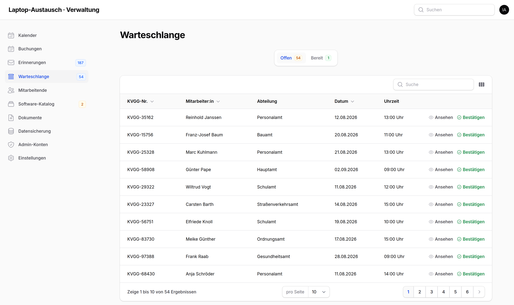<br><sub><b>Review queue</b> — IT works through confirmed bookings one by one before the exchange day.</sub></td>
    <td width="50%">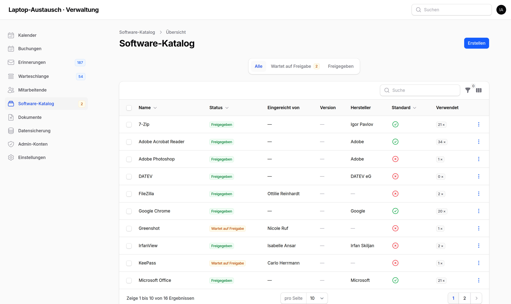<br><sub><b>Software catalog</b> — approve, reject or merge what employees typed, keeping the data clean.</sub></td>
  </tr>
  <tr>
    <td width="50%">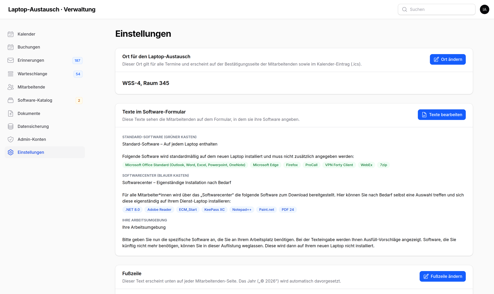<br><sub><b>Settings</b> — location and all employee-facing texts are editable without a developer.</sub></td>
    <td width="50%">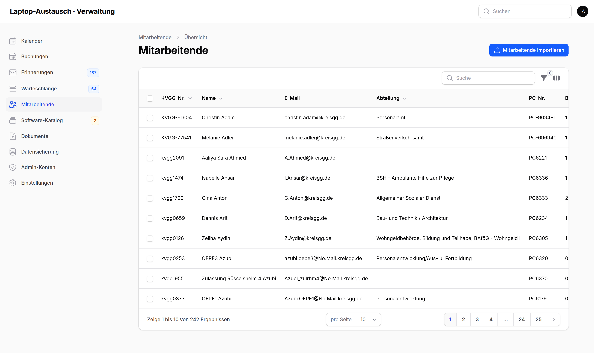<br><sub><b>Employees</b> — imported from the HR CSV export; read-only, with an admin-only bulk delete.</sub></td>
  </tr>
</table>

<sub>All screenshots show generated dummy data. No real employee data is contained in this repository.<br>
<i>Alle Screenshots zeigen generierte Testdaten. Es sind keine echten Personendaten im Repository enthalten.</i></sub>

---

## The problem, and what shaped the solution

What makes this project interesting is that most of its design was driven by hard constraints of the environment it had to run in. Each one ruled out the obvious approach:

| Constraint | Consequence for the design |
|---|---|
| **The server has no mail access.** | No confirmation emails are possible at all. Confirmations are rendered on-page and offered as an **iCal `.ics` download** the employee imports into Outlook. Reminders are `mailto:` links that open the *admin's own* mail client. |
| **Employees don't know their hardware specs**, and a browser cannot read them. | The employee form deliberately does *not* ask for serial numbers, CPU or RAM. It asks only what a person can actually answer: manufacturer, and which software they need. Hardware data is meant to come from an SCCM inventory export instead. |
| **No password infrastructure for 150 people.** | Login uses the **KVGG number + the PC number from the device sticker** — credentials the employee already physically has. Consciously a weak secret, so it is paired with rate limiting (5 attempts → 10-minute lockout) and the app holds no sensitive data beyond appointment details. |
| **The production server has no Composer, Node or Git.** | Deployment is a **self-contained bundle**: a build script produces a tarball including `vendor/` and compiled assets, plus install/update shell scripts that detect the PHP version, install missing extensions and configure Apache. |
| **IT staff should not need a developer for wording changes.** | Location, footer, and every text block of the software form are **editable in the admin panel**, each with a fallback so an emptied field restores the default. |
| **Two people typing "Adobe Reader" and "Acrobat Reader DC" break the imaging checklist.** | A **software catalog with an approval workflow**: unknown entries are saved as `pending` and visible only to their submitter until an admin approves, rejects or merges them into an existing entry. |

---

## Features

### For employees

- **Login** with KVGG number + PC number, case-insensitive, rate-limited against brute force.
- **Book an appointment** from a calendar grouped by calendar week, with live availability polling so a slot taken by someone else disappears without a page reload.
- **Reschedule** — the old slot is released and the new one taken in a single atomic operation; the software details carry over.
- **Software form** with autocomplete, showing which programs are preinstalled anyway and which are self-service from the software center — so people only enter what IT actually has to install.
- **Confirmation page** with the location and an `.ics` calendar download.
- **Documents** — guides the admins upload appear on the dashboard, and the card stays hidden while there are none.

### For the IT department (Filament admin panel)

- **Calendar as the panel home** — a week grid replacing the default dashboard. Free slots open a booking dialog, taken slots open the booking, and a dedicated *move mode* lets an admin reschedule someone by clicking the target slot.
- **Review queue** — confirmed bookings are worked through one at a time and marked ready, split into *open* and *ready* tabs.
- **Bookings** — mark no-show or sick with a note, cancel, move, bulk-delete, and print a **PDF imaging sheet**: the checklist a technician lays beside the new laptop listing exactly which software to install.
- **Employees** — CSV import that auto-detects the delimiter, converts Windows-1252 umlauts, maps headers regardless of column order, and reports errors per row.
- **Reminders** — everyone still without an appointment, each with a prefilled `mailto:` reminder.
- **Software catalog** — approve, reject or merge entries; a *used by* view shows who requested each program.
- **Exports** — Excel export that matches the current filters and sorting exactly, plus the PDF imaging sheets per booking or per day.
- **Backups** — create, download, delete and restore SQL dumps from the panel; migrations in production trigger an automatic backup first.
- **Roles** — `admin` and `viewer`, where viewers can see everything but change nothing.

---

## Architecture highlights

**Business logic lives in services, not controllers.** `app/Services/` holds `BookingManager`, `SlotGenerator`, `EmployeeImporter`, `ImagingSheetExporter`, `SoftwareCatalogResolver`, `SoftwareCatalogMerger`, `DatabaseBackupService` and `DownloadFileService` — each independently testable, and reused by both the Filament panel and the employee-facing controllers.

**Booking is race-condition safe.** Every create, cancel and move runs inside a `DB::transaction` with `lockForUpdate` on both the slot and the employee row, so two people clicking the same slot at the same moment cannot both win. Conflicts throw a `RuntimeException` with a German message that the Filament action turns into a notification.

```php
public function create(int $employeeId, int $timeSlotId): Booking
{
    return DB::transaction(function () use ($employeeId, $timeSlotId): Booking {
        $employee = Employee::whereKey($employeeId)->lockForUpdate()->first();

        if ($employee->activeBookings()->lockForUpdate()->exists()) {
            throw new RuntimeException('Diese:r Mitarbeiter:in hat bereits einen aktiven Termin.');
        }

        $slot = TimeSlot::whereKey($timeSlotId)->lockForUpdate()->first();

        if (! $slot || ! $slot->isAvailable()) {
            throw new RuntimeException('Dieses Zeitfenster ist nicht mehr verfügbar.');
        }
        // ...
    });
}
```

**Deleting data has to release slots explicitly.** The foreign-key cascade removes bookings but never resets the slot's `booked_count` and `status`, which would leave timeslots permanently stuck as *taken*. Bulk deletes therefore call `releaseSlotsForEmployees()` / `releaseSlotsForBookings()` **before** deleting — a subtle bug that only surfaces after the fact, so it is covered by its own tests.

**Two authentication guards.** `employee` for the public side and `admin` for the Filament panel, deliberately separate so that an admin session and an employee session never interfere.

**Exports bypass Filament's routing on purpose.** PDF and backup downloads are plain controller routes with a manual admin check, because the `auth:admin` middleware would redirect unauthenticated users to the route named `login` — which is the *employee* login.

---

## Tech stack

| | |
|---|---|
| **Backend** | PHP 8.3+, Laravel 13 |
| **Admin panel** | Filament 4 (Livewire) |
| **Frontend** | Blade, Tailwind CSS 4, Alpine.js, Vite |
| **Database** | MariaDB / MySQL |
| **Exports** | `maatwebsite/excel` (XLSX), `barryvdh/laravel-dompdf` (PDF) |
| **Server** | Debian 13, Apache, MariaDB |

Roughly 5,400 lines of application code, 1,400 lines of Blade templates and 3,100 lines of tests.

> **Note:** Laravel 13 + Filament 4 is a deliberate deviation from the original specification, which called for Laravel 11 + Filament 3 — Filament 3 cannot run on Laravel 13.

---

## Testing

```bash
php artisan test
```

**188 feature tests, 567 assertions, all passing.** They cover the booking and rescheduling flows, the double-booking guards, the CSV importer against a real-world sample, PDF and Excel generation, backup and restore, role-based access for both `admin` and `viewer`, and every admin page.

Tests run against a **separate MariaDB database** rather than SQLite, because the environment has no `pdo_sqlite` — `phpunit.xml` points at `laptop_austausch_test`.

---

## Deployment

The production server has no Composer, Node or Git, so releases are shipped as a self-contained bundle:

```bash
bash deploy/bundle.sh          # builds laptop-austausch-paket.tar.gz (incl. vendor/ + compiled assets)
```

```bash
# first install, on the server
sudo bash deploy/setup.sh      # PHP detection, extensions, database, .env, migrate, Apache vhost, admin account

# later updates
sudo bash deploy/update.sh     # maintenance mode → automatic backup → migrate → rebuild caches → live
```

See **[DEPLOY.md](DEPLOY.md)** for the full German step-by-step guide.

---

## Local setup

```bash
git clone git@github.com:eliasmhmd/laptop-austausch.git
cd laptop-austausch

composer install
npm install

cp .env.example .env
php artisan key:generate
# configure the MariaDB connection in .env

php artisan migrate --seed        # 2 admins, 150 employees, 200 slots, 50 bookings
npm run build
php artisan serve
```

Seeded logins: `admin@kreisgg.de` / `password` (admin) · `viewer@kreisgg.de` / `password` (read-only).

More detail in **[SETUP.md](SETUP.md)** (Windows + WSL2).

---

## Documentation

| Document | Contents |
|---|---|
| **[DEVELOPER.md](DEVELOPER.md)** | Developer handbook — architecture, database schema, conventions, pitfalls (German, ~1,150 lines) |
| **[DEPLOY.md](DEPLOY.md)** | Step-by-step deployment guide (German) |
| **[SETUP.md](SETUP.md)** | Local development setup (German) |
| **[CLAUDE.md](CLAUDE.md)** | Compact project reference — current state and design decisions |

The application interface and all end-user documentation are in **German**, since the users are the staff of a German district authority.

---

## Data protection

This repository contains **no real employee data**. The seeders generate fictional people, `.env` and the database backups under `storage/app/backups/` are excluded from version control, and every screenshot above was taken against generated test data.

---

## About this project

Developed for the IT department of **Kreis Groß-Gerau** to manage a district-wide laptop rollout, and in productive use there. Published here as a portfolio reference — please get in touch before reusing the code.
